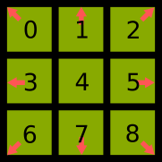

# Dev Game

Game from and for developers

## Description

The goal of the game is to create your own strategy and try to get to the end of the match defeating all the
 opponents strategies.

Clearly is a game made by developers, but why for developers? This is because you need to program your strategy in
 JavaScript language and given some data on each iteration of the game, you need to survive and defeat the other
  strategies. To avoid a long game, everything happens in a square field where in a fixed time is going to be
   surrounded by gas like the classic battle royal games (fortnite, warzone, etc...). The strategies can fight
    between them and restart health with some random points in the map.

The game is 24 hours, the strategies will be fighting between them even if you are not connected, and as soon as you
 get connected, you can see the statistics earned by your winner AI. At the same time, you can have more than one
  version of your strategies, but only one can fight at the moment.

## Develop your strategy

You need to have an account on the site. How can I create an account? Easy, just click the login button and get log-in
 with your github account. Once you have your account, go to your strategies dashboard and create a new one. By
  default there is a dummy code and over it you can program your strategy.

In the list of strategies you can decide which is your active strategy, depending if the strategy is valid or not
, because you can only use valid strategies. When a strategy is valid? The strategies are valid if after
  you save it on the server, the strategy passes all the tests. In order to check the validity of a strategy, there
   is a big set of test data, and this data is run with the strategy and each output produced by the strategy is
    validated, and if some of these tests fails then the strategy is not accepted.
     
Still can happen than the strategy even after passing all the tests cases is not valid. On these cases the strategies
 can play, and during the game when the strategy fails, then is disable and notified to the owner.

## Gamification in the game

The points of the users are calculated with the same idea of the ELO in the chess. When an user enter by the first
 time, it has 1500 points. Once the user start playing with one of his strategies, hi/she fights with other
  strategies in the field, after the game finishes then is applied the ELO calculation following the algorithm rules.
  
Yes but still I do not know how I earn points? Well, after the game finish, and with the standing of the game, each user
 has a position, and because each user start the play with a number of points, then is calculated the estimated
  position of each user given his/her points before the game start and this is compare with the real position in the
   standing, so the user earns more or less by the difference between the estimated and real standing in the game.

## Game API

If you want to create your own strategy like we said before, you start with a dummy code that can play and you can
 test it. Next you can see this strategy and we will explain what it das and with it help we also explain the basic
  structure of the strategies.

```
// Dummy strategy
{
  run(strategyInput}) {
    return this.calculateNextPosition();
  },
  calculateNextPosition({}) {
    const movements = validMovements();
    return randomNumber(movements.length);
  }
}
```

Each strategy should have a run() method to calculate the next move of the strategy. Like can be seen in the previous
 code, you can declare other methods and use them as you like. You can also see that we are using the
  validMovements() method, that is a helper function that returns the valid moves that you can play.

> Note: you need to be careful with the complexity of your code, because if your code takes longer than 150
> milliseconds to calculate your next move, your strategy output is skipped.

### Strategy input

```
strategyInput: { vision, players, position, name, health, attack, velocity }
```

- `vision: number[][]`: bidimentional array that contain the current vision area of the strategy
- `players: {position: {x: number, y: number}, health: number, attack: number}[]`: array with all the information about
 the opponents strategies in the vision area
- `position: {x: number, y: number}`: current position of the strategy in the vision area
- `health: number`: current strategy health. Initially is 100
- `attack: number`: current strategy attack. At the moment it is fixed and equals to 10.
- `velocity: number`: current strategy max velocity. At the moment the max velocity is 2.

### Strategy output

```
{ direction, velocity }
```

- `(direction: number)`: based on the direction's image, this value will define the strategy move.



- `(velocity: number)`: the number of steps to make in the selected direction. It should be between `0` and `max velocity`

### Helpers functions

```
validMovements({vision: number[][], position: number, velocity: number}) : {direction: number, velocity: number}[]
validateMovement({vision: number[][], position: number, velocity: number, direction: number}) : boolean
randomNumber(X: number) : number
transformMoveToPos(position: {x: number, y: number}, move: {direction: number, velocity: number})) : {x: number, y: number}
transformPosToMove(position: {x: number, y: number}, nextPosition: {x: number, y: number}) : {direction: number, velocity: number} | null
```

- `validMovements({vision, position, velocity})`: given the input values, return all the
 valid movements.

- `validateMovement({vision, position, velocity, direction})`: given the map and the
 current position, return true or false if the given movement is valid or
 not.

- `randomNumber(X)`: given a number `X`, the method return a random number between `0` and `X-1` 

- `transformMoveToPos(position, move)`: given the
 position of the user and the movement, the function return the position in the vision area in the format `{x: number
 , y: number}`.

- `transformPosToMove(position, nextPosition)`: given the initial
 position and the next position to move, the function return the movement need in the format `{direction
 : number, velocity: number}`.

### Enum values

You also have access to some enum values used in the field

```
FieldEnum.BLOCK = 0
FieldEnum.FREE = 1
FieldEnum.GAS = 2
```
